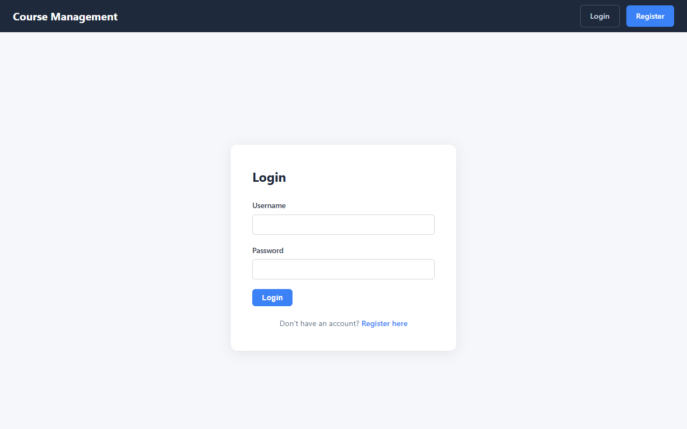
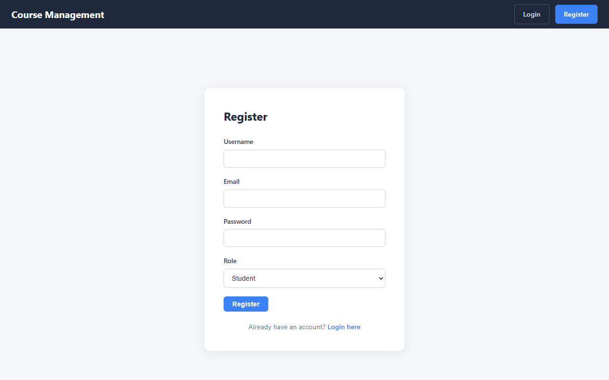
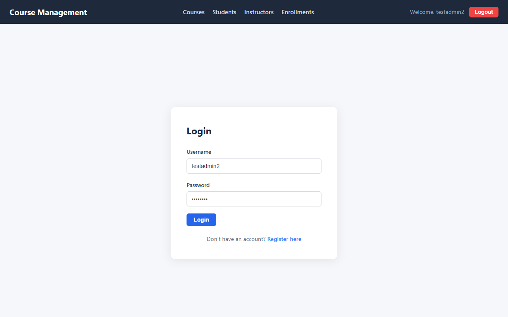
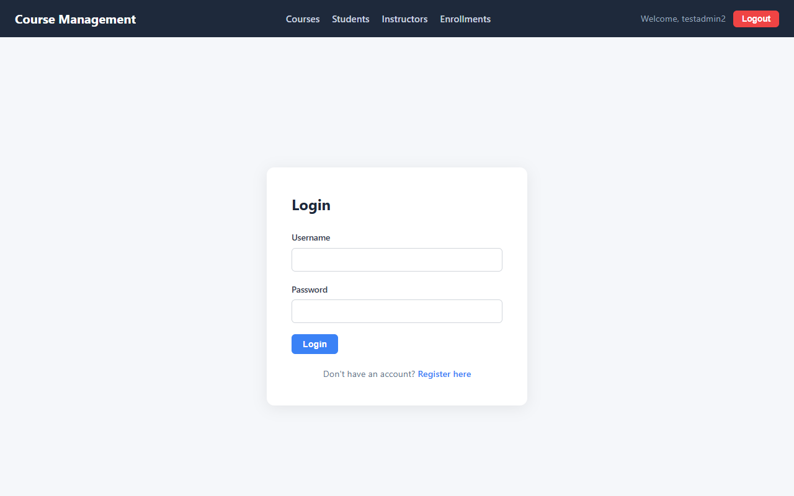

# Course Management System — Full Stack Web Application

## Application Description

This is a full-stack web engineering project consisting of:

- **Backend**: ASP.NET Core Web API for managing courses, instructors, students, and enrollments. Features JWT authentication with refresh tokens, role-based authorization, and Hangfire background jobs. Built with Entity Framework Core and SQLite.

- **Frontend**: React single-page application that integrates with the backend API. Features user registration and login, cookie-based auth persistence, protected routes, and full CRUD operations for all data models. Built with React, React Router, and Axios.

---

## Setup Instructions

### Prerequisites
- .NET 8 SDK (or later)
- Node.js (v16 or later) and npm

### Backend Setup

```bash
# Navigate to project root
cd CourseManagementAPI

# Restore dependencies
dotnet restore

# Run the backend (starts on http://localhost:5238)
dotnet run
```

The API will be available at `http://localhost:5238`. Swagger UI is available at `http://localhost:5238/swagger`.

### Frontend Setup

```bash
# Navigate to frontend directory
cd CourseManagementAPI/frontend

# Install dependencies
npm install

# Start the development server (starts on http://localhost:3000)
npm start
```

The React app will open in your browser at `http://localhost:3000`.

> **Important:** Make sure the backend is running before starting the frontend.

---

## API Routes Used

### Authentication
| Method | Endpoint | Description |
|--------|----------|-------------|
| POST | `/api/Auth/register` | Register a new user |
| POST | `/api/Auth/login` | Login and receive JWT token |
| POST | `/api/Auth/refresh-token` | Refresh an expired JWT token |
| POST | `/api/Auth/revoke-token` | Revoke a refresh token (logout) |

### Courses
| Method | Endpoint | Description |
|--------|----------|-------------|
| GET | `/api/Courses` | Get all courses |
| GET | `/api/Courses/{id}` | Get a course by ID |
| POST | `/api/Courses` | Create a new course |
| PUT | `/api/Courses/{id}` | Update a course |
| DELETE | `/api/Courses/{id}` | Delete a course |

### Students
| Method | Endpoint | Description |
|--------|----------|-------------|
| GET | `/api/Students` | Get all students |
| GET | `/api/Students/{id}` | Get a student by ID |
| POST | `/api/Students` | Create a new student |
| PUT | `/api/Students/{id}` | Update a student |
| DELETE | `/api/Students/{id}` | Delete a student |

### Instructors
| Method | Endpoint | Description |
|--------|----------|-------------|
| GET | `/api/Instructors` | Get all instructors |
| GET | `/api/Instructors/{id}` | Get an instructor by ID |
| POST | `/api/Instructors` | Create a new instructor |
| PUT | `/api/Instructors/{id}` | Update an instructor |
| DELETE | `/api/Instructors/{id}` | Delete an instructor |

### Enrollments
| Method | Endpoint | Description |
|--------|----------|-------------|
| GET | `/api/Enrollments` | Get all enrollments |
| GET | `/api/Enrollments/{id}` | Get an enrollment by ID |
| POST | `/api/Enrollments` | Create a new enrollment |
| PUT | `/api/Enrollments/{id}` | Update an enrollment |
| DELETE | `/api/Enrollments/{id}` | Delete an enrollment |

---

## Screenshots

> Insert screenshots of your running application below:

### Login Page


### Register Page


### Dashboard


### Courses Page


### Students Page


### Instructors Page


### Enrollments Page


---

## Submission Checklist

- [x] GitHub Repository link shared
- [x] README.md completed with all sections
- [x] Screenshots inserted in the Screenshots section above
- [x] Backend runs successfully (`dotnet run`)
- [x] Frontend runs successfully (`npm start`)
- [x] All CRUD operations work for every model
- [x] Login and Register work correctly
- [x] Cookie-based authentication persists across pages
- [x] Protected routes redirect to login when not authenticated
- [x] Laptop ready for live demo in the lab
